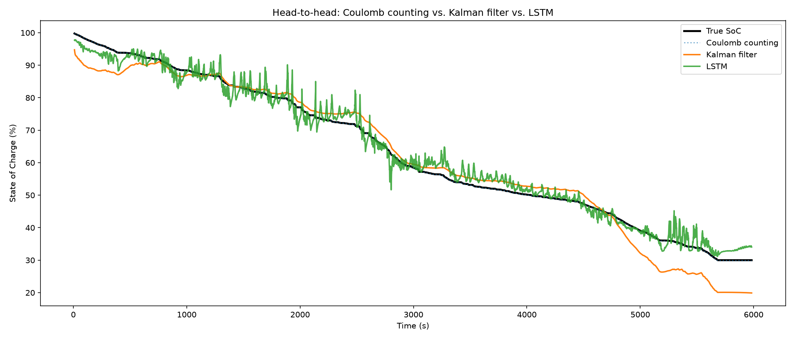

# EV Battery State-of-Charge Estimator

Three approaches to estimating a Li-ion battery's State of Charge (SoC) from
voltage, current, and temperature, benchmarked against each other on a
held-out drive cycle from the Panasonic 18650PF dataset (Kollmeyer et al.,
University of Wisconsin-Madison).

## Methods
- **Coulomb counting** — direct integration of current over time
- **Kalman filter** — Coulomb counting corrected against voltage, using a
  fitted OCV-SoC curve and internal resistance
- **LSTM** — trained on multiple drive cycles, evaluated on one it never saw

## Results (held-out drive cycle)

| Method | MAE (%) | RMSE (%) |
|---|---|---|
| Coulomb counting | 0.07 | 0.09 |
| Kalman filter | 3.60 | 4.66 |
| LSTM | 2.03 | 2.58 |

**A note on Coulomb counting's score:** its near-zero error here isn't evidence
it's the best method — the reference SoC used for scoring is itself computed
via Coulomb counting (from the dataset's own logged current), so this mainly
confirms the two integration methods agree, not that Coulomb counting is
reliable in general. The meaningful comparison is Kalman filter vs. LSTM,
where the LSTM wins clearly. Coulomb counting's real weakness only shows up
under the fault-injection test below, where it has no independent signal to
correct against.

## Key findings
- Coulomb counting alone drifts permanently under a simulated sensor bias and
  never self-corrects, while the Kalman filter — given the exact same faulty
  input — visibly tracks back toward the true SoC (see the Day 3
  fault-injection test).
- Between the two genuinely independent methods, the LSTM outperforms the
  Kalman filter (2.03% vs. 3.60% MAE) on a drive cycle it never saw during
  training.
- Both the Kalman filter and the LSTM degrade near the edges of the SoC range
  they were built from — the Kalman filter because its OCV curve was fitted
  on a limited range, the LSTM because extreme SoC values are underrepresented
  across the training files. A consistent limitation across both methods, not
  specific to either one.
- Training the LSTM on multiple drive cycles instead of one improved
  generalization by 3.7x (MAE 7.57% -> 2.03%), a bigger gain than any amount
  of hyperparameter tuning on a single file produced.

## How to run
1. `python3 -m venv venv && source venv/bin/activate`
2. `pip install -r requirements.txt`
3. Download the dataset from [Mendeley Data](https://data.mendeley.com/datasets/wykht8y7tg/1)
4. Open `01_explore_data.ipynb`, select the `venv` kernel, Run All